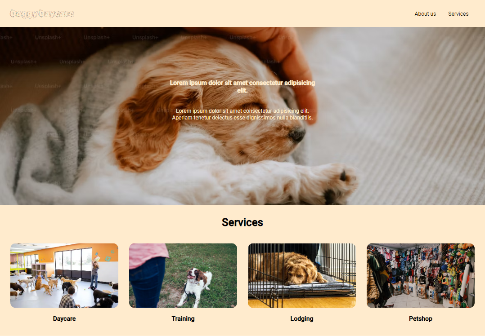

# Doggy Daycare

This is a static website that utilizes `Flexbox` for Responsive Layout.
A website is considered to have a responsive layout when it renders well on
all screen sizes.

## Technologies Used

- Flexbox

## Screenshots

## Demo

Live demo [here](https://gleeful-clafoutis-55861f.netlify.app/)

## Lessons Learned

- Created a website with Responsive Layout using Flexbox

## Project Status

Completed. Though I am open to suggestions

## Acknowledgements

This project is part of the [Codecademy](https://www.codecademy.com) Front-End Engineer Paths
